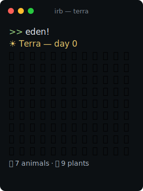

# Terra 🌍

[](../../actions/workflows/ci.yml)

A god game played entirely from IRB. The prompt is the controller; the map is
whatever your expressions return.

<p align="center">
  
  
</p>

<p align="center"><em>Left: a real session on loop — <code>eden!</code>, pilgrim rabbits, a smite, three days of fire,
winter, spring. Right: a fresh <code>eden!</code> world. Every frame is genuine game output.</em></p>

## Mac setup

Terra supports current macOS on both Apple Silicon and Intel. It needs Ruby
3.1 or newer and pins a known-good version in `.ruby-version` (currently
4.0.5) — the launchers, CI, and RubyMine all read that one file. Apple's
`/usr/bin/ruby` is 2.6 and is too old.

On a fresh Mac, install [Homebrew](https://brew.sh/) if needed, then:

```sh
brew install mise
bin/setup
```

`bin/setup` installs Terra's isolated Ruby, installs its gems, and runs the
test suite. It does not replace the Mac's system Ruby. If you already manage a
modern Ruby with rbenv, asdf, or Homebrew and do not have mise installed,
`bin/setup` will use that Ruby instead.

## Play

```sh
bin/terra          # terminal; selects the pinned Ruby automatically when mise is installed
ruby bin/play.rb   # same game as a plain Ruby script — use this for RubyMine's play button
```

Then, as is tradition:

```ruby
eden!                                      # or skip straight to a pre-filled world…
let_there_be :light                        # …or build one yourself, from the dark
lake = spawn :lake, at: [3, 4], size: 2
river = spawn :river, at: [0, 6], length: world.width, width: 2
mtn = spawn :mountain, name: "The Old Tooth", size: 3
mtn.erupt!
let_there_be :life
spawn :rabbit, count: 3
spawn :fern
pass 7                                     # spend a week on purpose — your acts also cost days
winter!                                    # reversible climate; spring! restores its water
world.plants.first.spread_remaining        # every root seed has a finite colony budget
smite 4, 4                                 # lightning starts a small fire; ◾ is cooled ash
spawn(:rabbit) { |r| r.hop_toward :water } # a block replaces its instinct
ordain :wolf, emoji: "🐺", habitat: :land, speed: 3   # invent a species
unmake lake                                # remove things; land reverts to plains
big_bang! width: 20, height: 12            # a bigger canvas (worlds are born with their size)
powers                                     # cheat sheet + the Laws of Terra
great_freeze!                              # heat death through Ruby's real Object#freeze
```

## The Laws of Terra

1. **The echo is the UI** — IRB prints every return value; `World#inspect` returns the map.
2. **Acting spends time** — every successful power costs days (most 1, `terraform` 3, the seasons 2); a refused act costs nothing, observing is free. `pass` spends days deliberately. No engine loop — the world still only ticks on command.
3. **Seasons are state** — `winter!` and `spring!` reversibly mutate this world; ice is terrain, never Ruby's `freeze`.
4. **The Great Freeze is forever** — `great_freeze!` calls `World#freeze`, whose `super` invokes Ruby's real, shallow, irreversible `Object#freeze`. `big_bang!` creates and binds a different World; nothing is unfrozen.

## Why this teaches Ruby

| You do | You learn |
|---|---|
| `spawn :river, length: 12, width: 2` | symbols, keyword args, shape-specific dimensions |
| `lake.name = "Mirrormere"` | `attr_accessor`, objects are always live |
| `lake.iced_over?`, `mtn.erupt!` | `?` predicates and `!` bang methods, without hiding Ruby's `freeze` API |
| `world.at(3, 4)` at the prompt | `inspect` is IRB's UI — every echo is a render |
| `world.features` | arrays of real objects, no DTOs anywhere |
| reading `feature.rb` | class macros (`manifest_as`), the Rails `has_many` pattern |
| `spawn(:rabbit) { \|r\| r.hop_toward :water }` | blocks as behavior; why brace blocks need parens here |
| `world.animals.map(&:age)` | Enumerable over live objects (Level 3 preview) |
| reading `World#freeze` | `super` extends behavior while preserving `Object#freeze` |
| `great_freeze!`, then `big_bang!` | frozen objects are not thawed; programs continue with new objects |

## Layout

```
bin/setup              one-time Ruby/gem setup + test gate for macOS
bin/terra              launcher (selects the project Ruby, then starts IRB)
lib/terra.rb           engine entry + Terra.genesis
lib/terra/world.rb     the grid; time, weather, bounded fire, render/illuminate!/tiles_near
lib/terra/tile.rb      one square: terrain symbol + owning feature
lib/terra/feature.rb   Lake/River/Mountain/Forest/Desert + manifest_as registry
lib/terra/being.rb     base class for living things (tick/age/die!)
lib/terra/animal.rb    🐇🐢🐟🦅 habitats, speed, wander/hop_toward, divine brains
lib/terra/plant.rb     🌿🌼🪷 finite per-seed colonies, lifespan, quiet deaths
lib/terra/godhood.rb   the top-level god commands (extended onto main)
lib/terra/cartographer.rb    all presentation — World#render delegates here
lib/terra/species_lookup.rb  world.rabbits/world.lakes — a method_missing mixin (Rails-concern style)
lib/terra/chronicle.rb + chronicle.html.erb   world history → standalone HTML (stdlib ERB)
test/                  minitest suite — run with `bundle exec rake` from Terra/
```

The class map lives in [docs/architecture.md](docs/architecture.md) — GitHub renders
the diagram inline; it's updated in the same PR as any structural change.

Every act is recorded: `chronicle` prints the story so far, `chronicle!` renders
it to `terra-chronicle.html` with a map snapshot per act. `world.history` is the
raw array, queryable like everything else.

## Roadmap

- **Level 1 — Genesis** ✅: terrain, attributes, smiting
- **Level 2 — Life** ✅ (you are here): `let_there_be :life`, tick-based time via `pass`, creatures with block-defined brains, bounded ecology and fire, terrain-aware `sow`, weather, reversible `winter!`/`spring!`, and the irreversible Great Freeze
- **Level 3 — Providence**: Enumerable queries as divine power (`world.animals.select(&:hungry)...`)
- **Level 4 — Godhood**: reopen classes mid-game; rabbits learn to fly
