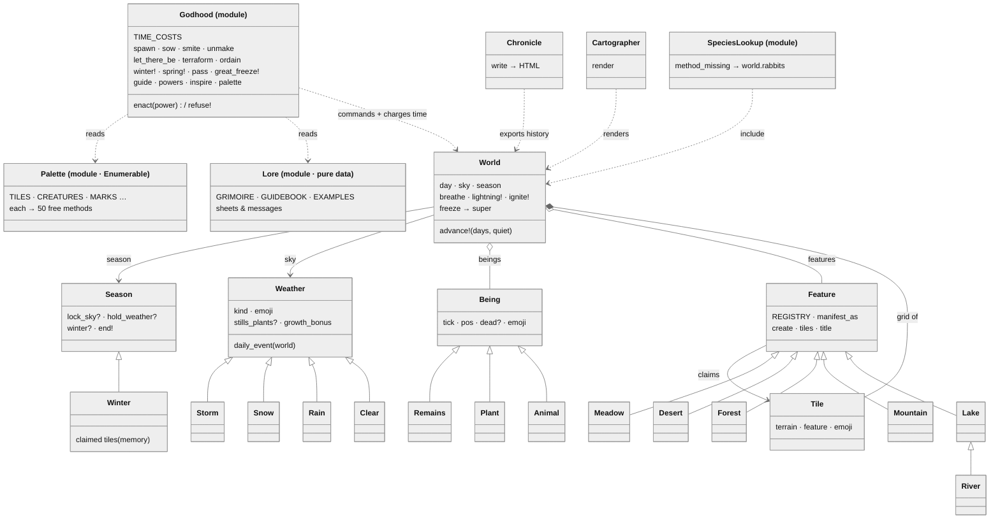

# The Shape of Terra

Every box is a real file in `lib/terra/`. Solid arrows are inheritance; diamonds
are ownership; dashed lines are "talks to." Kept current by hand — when a class
appears, dies, or changes owner, this map changes in the same PR.

## Where the "interfaces" are

Ruby has no `interface` keyword; three mechanisms play that role here.

1. **Duck type — `Being`.** Anything in `world.beings` must answer `tick`,
   `dead?`, `pos`, `emoji`, `kind`. Nothing declares the contract; the daily
   loop calls it and the test suite enforces it. `Remains` qualifies by quacking.
2. **Base class with calm defaults — `Weather`, `Season`.** The base states the
   whole surface; kinds override only their difference. `advance!` calls
   `daily_event` blind — method lookup is the `if` statement. Closest analog to
   a Kotlin interface with default methods.
3. **Module as role — `Enumerable`, `SpeciesLookup`.** The inverted contract:
   implement one hook (`each`) and receive ~50 methods. `Palette` earns
   `count`/`group_by`/`select` that way.

## Reading the arrows

| Arrow | Meaning |
|---|---|
| `A <\|-- B` | B inherits from A (`class B < A`) |
| `A *-- B` | composition — A builds and owns B for life (World's tile grid) |
| `A o-- B` | aggregation — A holds a changing collection of B (features, beings) |
| `A --> B` | A holds one B and swaps it (the sky, the season — the State pattern) |
| `A ..> B` | A talks to B without owning it (Godhood commands; Cartographer reads) |
